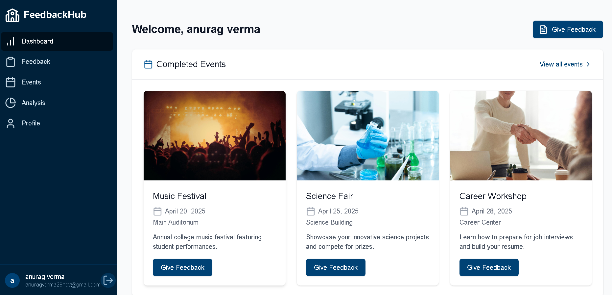

# 🎓 College Event Feedback System

A full-stack web application designed to **gather insightful feedback** from students on college events. It provides intuitive dashboards for both **students** and **administrators**, real-time **sentiment analysis**, and structured **feedback management**.

---

---

## 🖼️Screenshots


---


## 🔧 Tech Stack
- **Frontend**: React js  + HTML + CSS + JS
- **Backend**: Node js
- **Deployment**: Github, NetlifY

---

### ✨ Features
```plaintext
🔐Role-based Access Control 
Student and admin interfaces
Different permission levels

🎤Comprehensive Feedback System
10-point rating scale
Detailed text feedback
Event-specific submissions

📊 Advanced Analytics
Real-time sentiment analysis
Trend visualization
Participation metrics

👩‍💼User Management
Secure authentication
Profile customization
Password recovery

--

### 📁 Project Structure
```plaintext
college-feedback-system/
├── frontend/ # React + Tailwind 
│ ├── node_modules/
│ ├──Screenshots
│ ├──PPT
│ ├── src/
│ │ ├── components/
│ │ │ ├── analytics/
│ │ │ ├── auth/
│ │ │ ├── common/
│ │ │ ├── dashboard/
│ │ │ ├── feedback/
│ │ │ └── layouts/
│ │ ├── contexts/
│ │ ├── pages/
│ │ │ ├── admin/
│ │ │ ├── auth/
│ │ │ └── student/
│ │ ├── services/ # API integration
│ │ ├── App.tsx
│ │ ├── main.tsx
│ │ └── index.css
│ ├── tailwind.config.js
│ ├── vite.config.ts
│ └── package.json
│
├── .gitignore
└── README.md

--

### 🎨 UI Showcase

1. Registration Page

- Clean, intuitive signup form
- Required fields: Full Name, College Email, Password, Student ID
- Terms and conditions checkbox
- Option to sign in for existing users

2. Login Page

- Simple authentication form
- Remember me option
- Test credentials provided:
  - Student: student@college.edu / password
  - Admin: admin@college.edu / password
- Link to registration for new users

3. User Dashboard

- Personalized welcome message
- Completed events section with feedback options
- Event cards with dates and descriptions
- Quick access to feedback history

4. Feedback 

- Event selection dropdown
- 10-point rating system
- Detailed feedback text area
- Clean submission button

5. Upcoming Events 

- Comprehensive list of future events
- Clear event cards with dates
- Easy navigation to provide feedback
6. Feedback Analytics

- Sentiment distribution pie chart
- Feedback trends over time
- Key statistics (total feedback, avg rating)
- Recent feedback snippets

7. User Profile

- Personal information display
- Account security options
- Password change functionality
- Department and year information

8. Feedback History 

- Chronological list of all submissions
- Event names and dates
- Original feedback text
- Sentiment indicators

---

## 🛠️ Setup Instructions

### 1. Clone the repository

git clone https://github.com/your-username/college-feedback-system.git
cd college-feedback-system

### 2. Frontend Setup (React + Vite)

cd frontend
npm install
npm run dev

**Install Tailwind CSS**

npm install -D tailwindcss postcss autoprefixer
npx tailwindcss init -p


### 📊 Features Summary

✅ Student authentication
✅ Admin portal
✅ Feedback submission
✅ Sentiment analysis (real-time)
✅ Event management
✅ Feedback history
✅ Responsive design (Tailwind)

----

### 📦 Future Enhancements

📈 Analytics charts (dashboard)
📨 Email notifications
📥 CSV export of feedback
🔒 Role-based access control

--

### 🤝 Contributors

**Team Name- GodLike**
Members-
      1.**Anurag Verma**
      2.**Kartik Singh**
      3.**Aditya**

--

### 📄 License

This project is licensed under the MIT License - see the LICENSE file for details.

---

### 🏫 Footer

All rights reserved@feedbackhHub
  Designed by- Team GodLike
