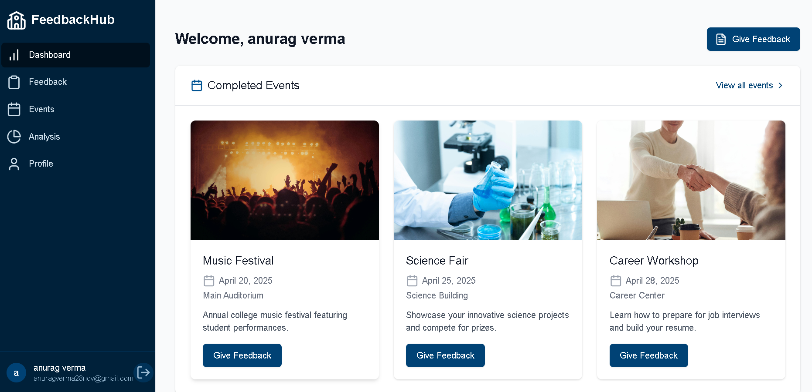
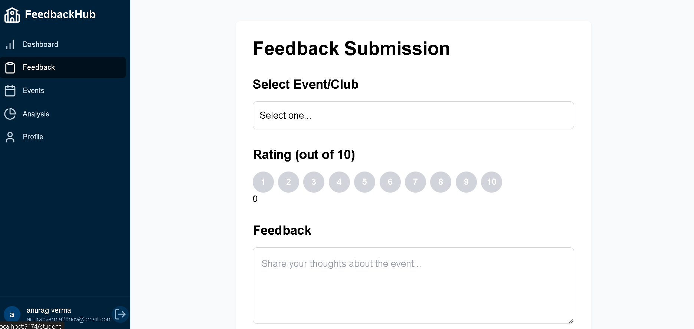
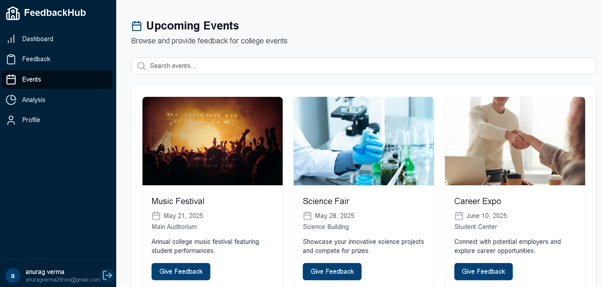
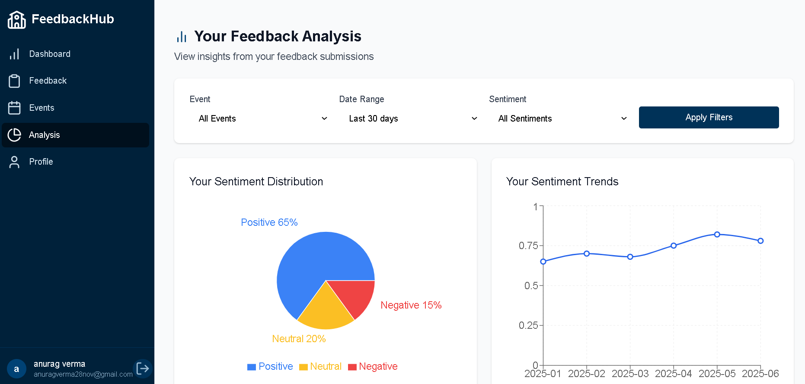
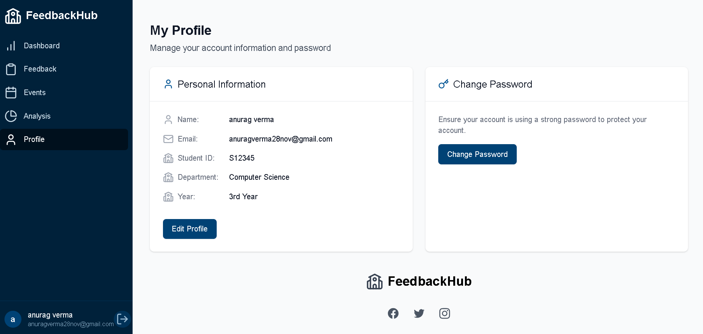
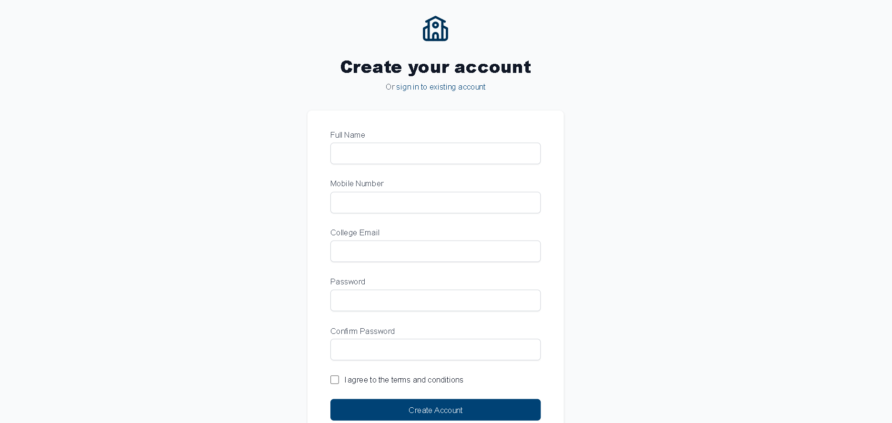

# 🎓 College Event Feedback System

A web application designed to **gather insightful feedback** from students on college events. It provides intuitive dashboards for both **students** and **administrators**, real-time **sentiment analysis**, and structured **feedback management**

---


## 🖼️Screenshots

       

          

          


---

## 📁 Project Structure

```
CollegeEventFeedbackSystem/
│
├── .gitignore
├── package.json
├── tsconfig.json
├── tsconfig.app.json
├── tsconfig.node.json
├── vite.config.ts
├── postcss.config.js
├── tailwind.config.js
├── index.html
├── College-Event-Feedback-System.pptx
│
├── Screenshots/
│   └── 1.png, 2.png, 3.png, 4.png, 5.png, 6.png, 7.png
│
└── src/
    ├── App.tsx                # Main app component and routing
    ├── main.tsx               # React entry point
    ├── index.css              # Global styles (Tailwind)
    ├── vite-env.d.ts          # Vite environment types
    │
    ├── components/
    │   ├── analytics/         # Charts and analytics components
    │   ├── auth/              # Auth-related components
    │   ├── common/            # Shared UI components (e.g., Footer)
    │   ├── dashboard/         # Dashboard UI components
    │   ├── feedback/          # Feedback form and related components
    │   └── layouts/           # Layouts for Student/Admin pages
    │
    ├── contexts/
    │   └── AuthContext.tsx    # Authentication context provider
    │
    ├── pages/
    │   ├── admin/             # Admin pages (Dashboard, Events, Feedback, Analysis, Profile)
    │   ├── auth/              # Login/Register pages
    │   └── student/           # Student pages (Dashboard, Events, Feedback, Profile, Analysis)
    │
    └── services/
        └── api.ts             # API service layer
```
---

## 🔧 Tech Stack
- **Frontend**: React js  + HTML + CSS + JS
- **Backend**: Node js
- **Deployment**: Github, NetlifY

---

## ✨ Features

🔐Role-based Access Control 
Student and admin interfaces
Different permission levels

🎤Comprehensive Feedback System
10-point rating scale
Detailed text feedback
Event-specific submissions

📊 Advanced Analytics
Real-time sentiment analysis
Trend visualization
Participation metrics

👩‍💼User Management
Secure authentication
Profile customization
Password recovery

---

## 🎨 UI Showcase

1. Registration Page

- Clean, intuitive signup form
- Required fields: Full Name, College Email, Password, Student ID
- Terms and conditions checkbox
- Option to sign in for existing users

2. Login Page

- Simple authentication form
- Remember me option
- Test credentials provided:
  - Student: student@college.edu / password
  - Admin: admin@college.edu / password
- Link to registration for new users

3. User Dashboard

- Personalized welcome message
- Completed events section with feedback options
- Event cards with dates and descriptions
- Quick access to feedback history

4. Feedback 

- Event selection dropdown
- 10-point rating system
- Detailed feedback text area
- Clean submission button

5. Upcoming Events 

- Comprehensive list of future events
- Clear event cards with dates
- Easy navigation to provide feedback
6. Feedback Analytics

- Sentiment distribution pie chart
- Feedback trends over time
- Key statistics (total feedback, avg rating)
- Recent feedback snippets

7. User Profile

- Personal information display
- Account security options
- Password change functionality
- Department and year information

8. Feedback History 

- Chronological list of all submissions
- Event names and dates
- Original feedback text
- Sentiment indicators

9. Footer

All rights reserved@feedbackhHub<br>
  Designed by- Team GodLike<br>

---

## 🛠️ Setup Instructions

### 1. Clone the repository

git clone https://github.com/AnuragVerma28nov/CollegeEventFeedbackSystem.git<br>
cd CollegeEventFeedbackSystem

### 2. Frontend Setup (React + Vite)

cd frontend<br>
npm install<br>
npm run dev<br>

### 3. Install Tailwind CSS

npm install -D tailwindcss postcss autoprefixer<br>
npx tailwindcss init -p<br>

---

## 📊 Features Summary

✅ Student authentication<br>
✅ Admin portal<br>
✅ Feedback submission<br>
✅ Sentiment analysis (real-time)<br>
✅ Event management<br>
✅ Feedback history<br>
✅ Responsive design (Tailwind)<br>

----

## 📦 Future Enhancements

📈 Analytics charts (dashboard)<br>
📨 Email notifications<br>
📥 CSV export of feedback<br>
🔒 Role-based access control<br>

---

## 🤝 Contributors

**Team Name- GodLike**<br>
Members-<br>
      1.**Anurag Verma**<br>
      2.**Kartik Singh**<br>
      3.**Aditya**<br>

---

## 🧑‍💻 Author<br>
  - Anurag Verma <br>
  - Year: 2025  <br>
Thank you for visiting this repository!<br>

---

